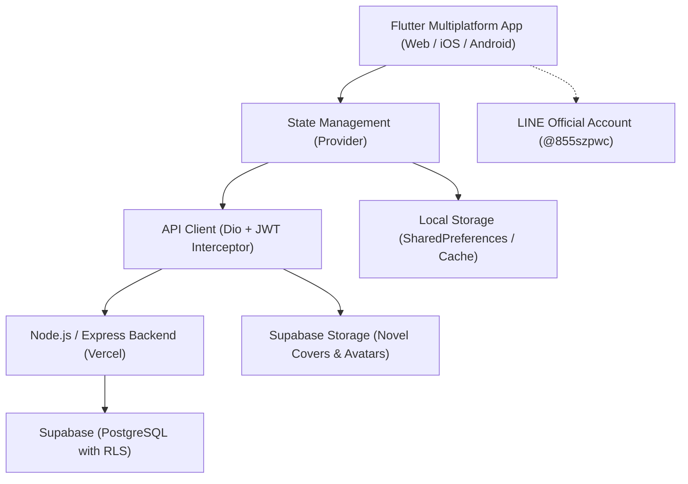

<p align="center">
  
</p>

<h1 align="center">Rels Reading</h1>

<p align="center">
  <strong>คลังนิยายและการอ่านระดับพรีเมียม (Premium Webnovel & Reading Platform)</strong><br>
  แพลตฟอร์มการอ่านและเผยแพร่งานเขียนระดับพรีเมียม พัฒนาด้วย Flutter & Supabase รองรับทั้ง Web และ Mobile
</p>

<p align="center">
  
  
  
  
  
  
</p>

---

## 📖 สารบัญ (Table of Contents)

- [จุดเด่นและฟีเจอร์สำคัญ (Key Features)](#-จุดเด่นและฟีเจอร์สำคัญ-key-features)
- [สถาปัตยกรรมระบบและเทคโนโลยี (Tech Stack & Architecture)](#-สถาปัตยกรรมระบบและเทคโนโลยี-tech-stack--architecture)
- [โครงสร้างโฟลเดอร์ (Project Structure)](#-โครงสร้างโฟลเดอร์-project-structure)
- [การเริ่มต้นใช้งาน (Getting Started)](#-การเริ่มต้นใช้งาน-getting-started)
- [การตั้งค่าฐานข้อมูล Supabase (Database Setup)](#-การตั้งค่าฐานข้อมูล-supabase-database-setup)
- [การรันชุดทดสอบ (Running Tests)](#-การรันชุดทดสอบ-running-tests)
- [การ Build และ Deployment บน Vercel](#-การ-build-และ-deployment-บน-vercel)
- [ความปลอดภัยและมาตรฐานความเป็นส่วนตัว (Security & PDPA)](#-ความปลอดภัยและมาตรฐานความเป็นส่วนตัว-security--pdpa)
- [การติดต่อและช่องทางติดตาม (Community & Contact)](#-การติดต่อและช่องทางติดตาม-community--contact)

---

## ✨ จุดเด่นและฟีเจอร์สำคัญ (Key Features)

### 📚 ประสบการณ์การอ่านระดับพรีเมียม (E-Reader Engine)
* **ปรับแต่งการอ่านได้อย่างอิสระ**: เลือกปรับขนาดตัวอักษร, ระยะห่างบรรทัด (Line Height), ระยะขอบ (Padding)
* **ฟอนต์ยอดนิยมสำหรับภาษาไทย**: รองรับ Google Fonts อาทิ *Prompt, Sarabun, Kanit, Merriweather*
* **โหมดสีถนอมสายตา**: โหมดสว่าง (Light), โหมดมืด (Dark Mode), โหมดสีซีเปีย (Sepia), และโหมดดำสนิท (AMOLED Void Black)
* **โหมดการเลื่อนอ่าน**: รองรับทั้งแบบเลื่อนต่อเนื่อง (Continuous Scroll) และแบบเปิดหน้า (Paginated Mode)
* **แถบสารบัญด่วน (Chapter Drawer)**: กระโดดข้ามบทได้ทันที พร้อมบันทึกความคืบหน้าการอ่านอัตโนมัติ
* **ระบบความคิดเห็นประจำตอน (Chapter Comments)**: อ่านและแลกเปลี่ยนความเห็นท้ายแต่ละตอนได้แบบเรียลไทม์

### ✍️ ระบบนักเขียนและแดชบอร์ดจัดการผลงาน (Author Studio)
* **สร้างและเผยแพร่นิยาย**: อัปโหลดรูปภาพปกนิยายขึ้น Supabase Storage โดยตรง พร้อมระบบใส่เรื่องย่อและแท็กหมวดหมู่
* **ระบบแท็กไดนามิก (#Hashtags)**: ค้นหาและจำแนกนิยายได้แม่นยำ เช่น `#กำลังภายใน`, `#เกิดใหม่`, `#แฟนตาซี`, `#ไซไฟ`, `#โรแมนติก`
* **จัดการตอน (Chapter Management)**: เขียน, บันทึกฉบับร่าง, เผยแพร่ตอนใหม่, และเรียงลำดับบทได้ง่าย
* **แดชบอร์ดนักเขียน (Author Dashboard)**: ดูสถิติจำนวนตอน, ยอดผู้ติดตาม, และจำนวนการเก็บเข้าชั้นหนังสือ

### 💬 คอมมูนิตี้และบอร์ดแลกเปลี่ยน (Community Discussions)
* **เว็บบอร์ดแยกหมวดหมู่**: พูดคุยนิยาย, วิเคราะห์ทฤษฎี/สปอยล์, แนะนำนิยายใหม่, แจ้งปัญหาการใช้งาน
* **กระทู้ถาม-ตอบและปักหมุดนักเขียน**: ระบบตอบกลับ (Threaded Replies) พร้อมตราสัญลักษณ์ผู้แต่ง (Author Badge)
* **ซิงค์ข้อมูลข้ามอุปกรณ์ (Cloud Sync)**: เก็บข้อมูลและซิงค์กระทู้ข้ามอุปกรณ์อัตโนมัติ พร้อมระบบ Local Fallback ออฟไลน์

### 🔔 การแจ้งเตือนอัจฉริยะ & LINE Official Account
* **ศูนย์แจ้งเตือนในแอป (Notification Center)**: แจ้งเตือนเมื่อมีนิยายตอนใหม่, มีคนตอบกลับกระทู้, หรือประกาศจากทีมงาน
* **เชื่อมต่อ LINE OA (`@855szpwc`)**: สแกน QR Code หรือเปิดลิงก์เชื่อมต่อ LINE เพื่อรับข่าวสารและสิทธิพิเศษอย่างรวดเร็ว

### 🎯 ภารกิจรายวันและชั้นหนังสือส่วนตัว (Missions & Bookshelf)
* **ภารกิจรายวัน (Daily Missions)**: สะสมแต้มและสตรีคการเข้าอ่านเพื่อรับรางวัล
* **ชั้นหนังสือ (Personal Bookshelf)**: บันทึกนิยายเรื่องโปรด, จัดเรียงตามวันที่อ่านล่าสุด, สลับมุมมองตาราง (Grid) และรายการ (List)

### 🛡️ ระบบความปลอดภัยและรายงานเนื้อหา (Safety & Moderation)
* **เข้าสู่ระบบได้หลากหลาย**: รองรับ Google OAuth Sign-In, LINE Login, และ Email/Password
* **ระบบรายงานนิยาย (Novel Reporting System)**: ส่งรายงานและยื่นอุทธรณ์เนื้อหาที่ไม่เหมาะสม เพื่อสร้างสังคมการอ่านที่ปลอดภัย
* **PDPA Compliance**: ระบบ Consent Dialog แจ้งนโยบายการจัดเก็บและคุ้มครองข้อมูลส่วนบุคคลตามกฎหมาย

---

## 🛠 สถาปัตยกรรมระบบและเทคโนโลยี (Tech Stack & Architecture)



| Layer | Technology | รายละเอียด |
| :--- | :--- | :--- |
| **Frontend Framework** | **Flutter 3.13+ (Dart)** | Cross-platform สำหรับ Web, Android, iOS และ Desktop |
| **State Management** | **Provider 6.1.2** | `AuthProvider`, `NovelProvider`, `BookmarkProvider`, `ReaderSettingsProvider` |
| **Design System** | **Material 3 / Electric Cyan** | Dark Mode เน้นเฉด `#0E0F14` พร้อมโทนสีไฮไลท์ฟ้าสว่าง `#00E5FF` |
| **HTTP & Networking** | **Dio 5.7.0** | จัดการ Network Requests, Timeout (15s), และ JWT Auth Interceptors |
| **Authentication** | **Google OAuth & LINE** | `google_sign_in`, `google_sign_in_web`, รองรับการ Link บัญชี |
| **Database** | **Supabase PostgreSQL** | Row Level Security (RLS), Triggers สำหรับนับจำนวนตอนอัตโนมัติ |
| **Asset Storage** | **Supabase Storage** | จัดเก็บภาพปกนิยายความละเอียดสูงและรูปโปรไฟล์ผู้ใช้ |
| **RAM Optimization** | **ImageCache Limitation** | จำกัดหน่วยความจำแคชภาพที่ 64MB ป้องกันปัญหา Memory Leak |
| **Deployment** | **Vercel** | Build Web Release ด้วย `build.sh` พร้อม SPA Rewrite ใน `vercel.json` |

---

## 📁 โครงสร้างโฟลเดอร์ (Project Structure)

```text
rels_reading/
├── assets/
│   └── images/                     # โลโก้แอป (app_logo.png), QR Code LINE OA
├── lib/
│   ├── config/
│   │   └── app_config.dart         # ค่าคงที่ระบบ, URLs, OAuth Client IDs
│   ├── core/
│   │   ├── api/                    # Dio client, Interceptors ตรวจสอบ Token
│   │   ├── storage/                # การจัดเก็บ Local Cache, Token, PDPA Consent
│   │   ├── theme/                  # ธีมสีแอป (AppTheme, Dark / Light Palette)
│   │   └── widgets/                # คอมโพเนนต์ส่วนกลาง (AppLogo, ปุ่มล็อกอิน)
│   ├── data/
│   │   ├── mock_data.dart          # ข้อมูลจำลองสำหรับโหมดออฟไลน์
│   │   └── repositories/           # Repositories (Auth, Novel, Chapter, Bookmark, Community)
│   ├── models/                     # Data Models (Novel, Chapter, User, Comment, Notification, ฯลฯ)
│   ├── providers/                  # State Providers (Auth, Novel, Bookmark, ReaderSettings)
│   ├── screens/
│   │   ├── auth/                   # หน้าเข้าสู่ระบบและสมัครสมาชิก (Login / Register)
│   │   ├── bookmarks/              # หน้าชั้นหนังสือและนิยายที่บันทึกไว้
│   │   ├── community/              # หน้าเว็บบอร์ดและห้องสนทนานักอ่าน
│   │   ├── home/                   # หน้าหลัก แสดงแบนเนอร์และนิยายแนะนำ
│   │   ├── missions/               # หน้าภารกิจและของรางวัลรายวัน
│   │   ├── novel/                  # หน้ารายละเอียดนิยาย, จัดการตอน, แดชบอร์ดนักเขียน
│   │   ├── profile/                # หน้าโปรไฟล์ผู้ใช้และการตั้งค่า
│   │   ├── reader/                 # หน้าอ่านนิยาย E-Reader เต็มรูปแบบ
│   │   ├── main_nav_screen.dart    # แถบนำทางหลัก 5 เมนู (Bottom Navigation)
│   │   └── splash_screen.dart      # หน้าโหลดเริ่มต้นและตรวจเช็คการนำทาง Deep Link
│   └── main.dart                   # จุดเริ่มต้นแอปพลิเคชันและการตั้งค่าระบบ
├── supabase/
│   └── setup_novels_tables.sql     # สคริปต์ SQL สร้างตาราง, RLS Policies, Triggers, และข้อมูลเริ่มต้น
├── test/
│   └── unit_test.dart              # ชุดทดสอบ Unit Test ครอบคลุม 17 รายการ
├── build.sh                        # Shell script สำหรับดาวน์โหลด Flutter SDK และ build บน Vercel
├── vercel.json                     # การตั้งค่า Vercel Web Deployment & SPA Routing
└── pubspec.yaml                    # การประกาศ Dependencies และ Asset ต่างๆ ของโปรเจกต์
```

---

## 🚀 การเริ่มต้นใช้งาน (Getting Started)

### ข้อกำหนดเบื้องต้น (Prerequisites)
* ติดตั้ง [Flutter SDK](https://docs.flutter.dev/get-started/install) (เวอร์ชัน 3.13 ขึ้นไป)
* ติดตั้ง Dart SDK (เวอร์ชัน 3.13 ขึ้นไป)
* บัญชี [Supabase](https://supabase.com/) สำหรับจัดการฐานข้อมูลและที่เก็บไฟล์

### ขั้นตอนการรันแอปพลิเคชันในเครื่อง (Local Setup)

1. **Clone repository:**
   ```bash
   git clone https://github.com/Nattapon6712732105/rels_reading.git
   cd rels_reading
   ```

2. **ติดตั้ง Dependencies:**
   ```bash
   flutter pub get
   ```

3. **ตรวจสอบความพร้อมของสภาพแวดล้อม:**
   ```bash
   flutter doctor
   ```

4. **รันโปรเจกต์ (เลือก Platform ที่ต้องการ):**
   ```bash
   # สำหรับเว็บเบราว์เซอร์ (Chrome)
   flutter run -d chrome

   # สำหรับอุปกรณ์พกพา (Android / iOS)
   flutter run
   ```

---

## 🗄 การตั้งค่าฐานข้อมูล Supabase (Database Setup)

ระบบนิยาย คอมเมนต์ และชั้นหนังสือของ Rels Reading เชื่อมต่อกับ Supabase PostgreSQL โดยสามารถตั้งค่าได้ง่ายๆ ดังนี้:

1. เข้าสู่ **Supabase Dashboard** ของโปรเจกต์คุณ
2. ไปที่เมนู **SQL Editor**
3. คัดลอกเนื้อหาทั้งหมดจากไฟล์ [`supabase/setup_novels_tables.sql`](supabase/setup_novels_tables.sql) แล้วกด **Run**
4. สคริปต์จะทำการ:
   * สร้างตาราง `novels`, `chapters`, `bookmarks`, `comments`, และ `reports`
   * กำหนดสิทธิ์ความปลอดภัยด้วย **Row Level Security (RLS)**
   * สร้าง Database Function และ Trigger สำหรับคำนวณ `chapters_count` อัตโนมัติเมื่อมีการเพิ่ม/ลบตอน
   * ใส่ข้อมูลตัวอย่างนิยายยอดนิยม 4 เรื่อง (พร้อมบทเนื้อหา) ให้พร้อมใช้งานทันที

---

## 🧪 การรันชุดทดสอบ (Running Tests)

โปรเจกต์มีชุดทดสอบครอบคลุมการทำงานของ Data Models, การเข้ารหัส/ถอดรหัส JSON, การซิงค์ข้อมูล Local Storage, PDPA Consent, ระบบคอมมูนิตี้ และการคำนวณสถิติต่างๆ:

```bash
flutter test
```

ผลลัพธ์การทดสอบตัวอย่าง:
```text
00:05 +17: All tests passed!
```

---

## 🌐 การ Build และ Deployment บน Vercel

โปรเจกต์ได้รับการออกแบบให้สามารถ Deploy ขึ้น **Vercel** สำหรับโหมด Flutter Web ได้โดยอัตโนมัติ:

1. **สคริปต์ [`build.sh`](build.sh)**:
   * ทำการดาวน์โหลด Flutter SDK Stable channel แบบตื้น (depth 1)
   * ดำเนินการ `flutter pub get` และรันคำสั่ง `flutter build web --release`
2. **การตั้งค่า [`vercel.json`](vercel.json)**:
   * กำหนด `outputDirectory` ไปยัง `build/web`
   * มี Rewrites rule สำหรับรองรับ Single Page Application (SPA) Deep Links ไม่ให้เกิดปัญหา Error 404

คำสั่งสำหรับทดสอบ Build Web Release ในเครื่อง:
```bash
flutter build web --release
```

---

## 🛡️ ความปลอดภัยและมาตรฐานความเป็นส่วนตัว (Security & PDPA)

* **Thailand PDPA Compliance**: มีหน้าต่างข้อตกลงและเงื่อนไขการใช้งาน (Consent Dialog) ก่อนเริ่มใช้งานจริง สามารถตรวจสอบสถานะการกดยินยอมได้
* **Token Protection**: Access Token และ Refresh Token ได้รับการจัดเก็บอย่างปลอดภัยผ่าน Secure Interceptors
* **Content Moderation**: สมาชิกสามารถรายงานนิยายที่มีเนื้อหาละเมิดข้อกำหนด และนักเขียนสามารถส่งคำอุทธรณ์ (Appeal) ตรวจสอบความถูกต้องได้
* **Row Level Security (RLS)**: ป้องกันไม่ให้ผู้ใช้แก้ไขหรือลบผลงานของนักเขียนท่านอื่นโดยไม่ได้รับอนุญาต

---

## 💬 การติดต่อและช่องทางติดตาม (Community & Contact)

<p align="center">
  <br>
  <strong>LINE Official Account:</strong> <a href="https://lin.ee/9ENF0Wl">@855szpwc</a><br>
  สแกนเพื่อติดตามข่าวสาร กิจกรรม และนิยายอัปเดตใหม่ก่อนใคร
</p>

---

<p align="center">
  พัฒนาด้วยความใส่ใจเพื่อประสบการณ์การอ่านนิยายที่ดีที่สุด ✨<br>
  © 2026 Rels Reading. All Rights Reserved.
</p>
